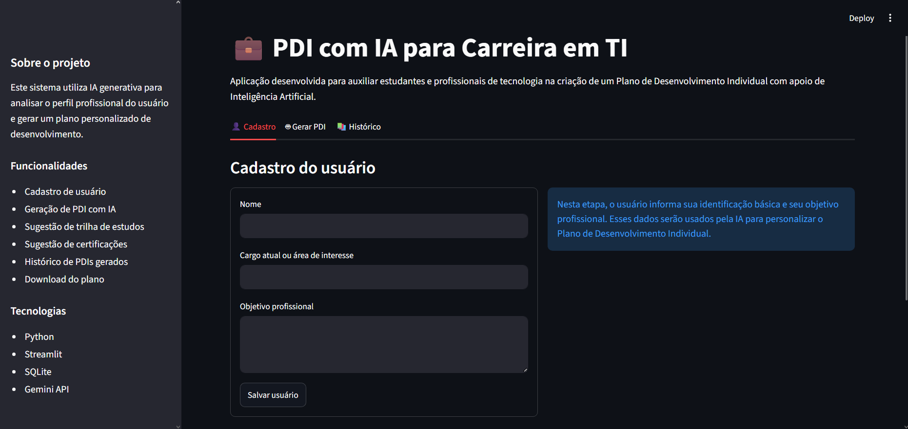
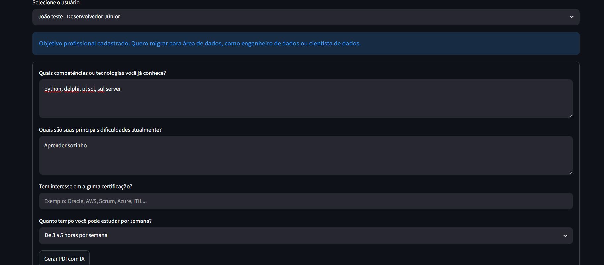
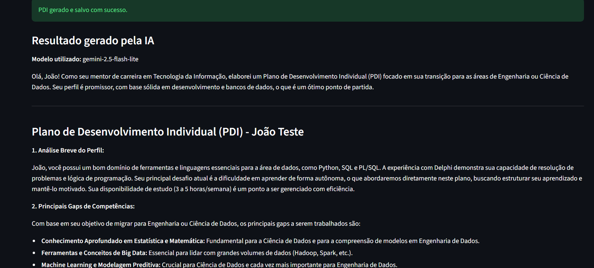
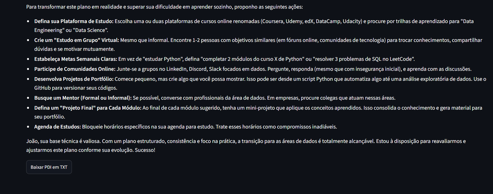
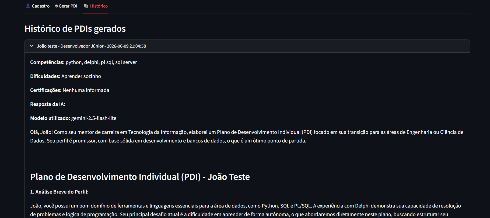

# PDI com IA para Carreira em TI

## Descrição do problema

Estudantes e profissionais da área de tecnologia frequentemente possuem dificuldade para organizar seus estudos, identificar lacunas de competências e escolher certificações adequadas para sua evolução profissional. Muitas vezes, o usuário sabe seu objetivo de carreira, mas não possui clareza sobre quais passos seguir, quais tecnologias estudar ou como estruturar um plano de desenvolvimento.

## Objetivo da solução

O objetivo deste projeto é desenvolver uma aplicação funcional que utilize Inteligência Artificial para gerar um Plano de Desenvolvimento Individual personalizado para usuários da área de tecnologia.

A aplicação permite cadastrar um usuário, informar competências atuais, dificuldades, certificações de interesse e disponibilidade de estudo. Com base nessas informações, a IA gera um plano com análise do perfil, gaps de competências, trilha de estudos, sugestões de certificações, cronograma e próximos passos práticos.

## Tecnologias utilizadas

- Python
- Streamlit
- SQLite
- Gemini API
- python-dotenv
- Google GenAI SDK

## Funcionamento da IA

A aplicação utiliza a Gemini API como serviço de Inteligência Artificial generativa.

O sistema coleta os dados informados pelo usuário e monta um prompt estruturado contendo:

- nome do usuário;
- cargo atual ou área de interesse;
- objetivo profissional;
- competências atuais;
- dificuldades;
- certificações de interesse;
- disponibilidade semanal de estudo.

Essas informações são enviadas para o modelo Gemini, que retorna um Plano de Desenvolvimento Individual personalizado em português, contendo análise do perfil, gaps de competências, trilha de estudos, sugestões de certificações, cronograma e próximos passos.

## Arquitetura do sistema

O projeto possui uma arquitetura simples, dividida em três arquivos principais:

- `app.py`: responsável pela interface da aplicação em Streamlit.
- `database.py`: responsável pela criação das tabelas, conexão com o banco SQLite e persistência dos dados.
- `ai_service.py`: responsável pela integração com a Gemini API e geração do PDI.

O banco de dados utilizado é SQLite, armazenando os usuários cadastrados e o histórico de PDIs gerados.

## Funcionalidades

- Cadastro de usuário.
- Identificação do cargo atual ou área de interesse.
- Registro do objetivo profissional.
- Coleta de competências e dificuldades.
- Geração de PDI com Inteligência Artificial.
- Sugestão de trilha de estudos.
- Sugestão de certificações.
- Histórico de PDIs gerados.
- Download do PDI em arquivo TXT.

## Como executar o projeto

### 1. Clonar o repositório

```bash
git clone link-do-repositorio
```

### 2. Entrar na pasta do projeto

```bash
cd pdi-ia-carreira
```

### 3. Criar ambiente virtual

```bash
python -m venv venv
```

### 4. Ativar ambiente virtual no Windows

```bash
venv\Scripts\Activate.ps1
```

### 5. Instalar dependências

```bash
pip install -r requirements.txt
```

### 6. Criar arquivo `.env`

Crie um arquivo chamado `.env` na raiz do projeto com o seguinte conteúdo:

```env
GEMINI_API_KEY=sua_chave_aqui
GEMINI_MODEL=gemini-2.5-flash
```

### 7. Executar a aplicação

```bash
streamlit run app.py
```

## Prints da aplicação

### Tela de cadastro



### Geração do PDI com IA



### Resultado gerado pela IA




### Histórico de PDIs gerados



## Principais desafios encontrados

Durante o desenvolvimento, um dos principais desafios foi configurar corretamente a integração com a Gemini API, incluindo a ativação da API no projeto, configuração da chave de acesso e tratamento de erros relacionados à disponibilidade dos modelos.

Outro desafio foi organizar o fluxo da aplicação para que os dados fossem salvos corretamente no banco SQLite e o histórico de PDIs pudesse ser consultado posteriormente.

## Conclusão

O projeto permitiu desenvolver uma solução prática utilizando Inteligência Artificial aplicada ao planejamento de carreira em tecnologia. A aplicação atende ao objetivo de auxiliar usuários na organização de seus estudos, identificação de gaps de competências e definição de próximos passos para evolução profissional.
